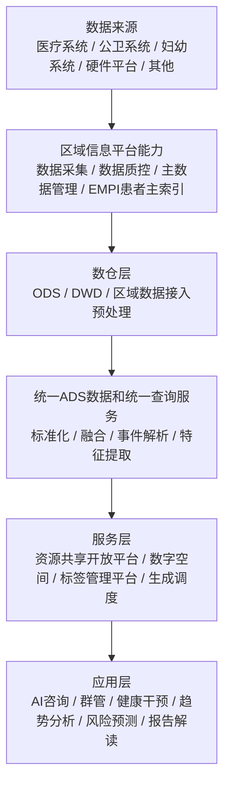

# 健康画像系统设计架构梳理

**版本**：v1.1  
**日期**：2026-05-15  
**定位**：健康画像及健康空间系统总体架构设计说明

---

## 版本变更记录

| 版本 | 日期 | 变更内容 |
|------|------|---------|
| v1.1（修订） | 2026-05-15 | 根据《健康画像--功能全景_2026-05-15.eddx》同步第5章二级模块清单和层级（删除"标签知识库/标签生成能力"；调度系统改为任务列表/详情/结果/调度；配置中心新增"科普文章管理/诊断屏蔽管理"；数据共享层级合并） |
| v1.1 | 2026-05-15 | 新增第5章"功能模块全景"，覆盖8大功能模块三级功能点清单；原第5~7章顺延为第6~8章；增加功能模块与架构分层的映射关系表 |
| v1.0 | 2026-05-07 | 初版，梳理应用层、服务层、数据层、核心数据流和前后台应用构建情况 |

---

## 1. 总体架构

健康画像系统采用"应用层、服务层、数据层"的三层架构。

核心思路是：底层汇聚医疗、公卫、妇幼、硬件等多源数据，经标准化、融合、标签化和指标化处理后，生成个人、人群、机构、专家等数字空间，并向上支撑健康分析、风险预测、干预建议、报告解读和人群管理等应用。

---

## 2. 应用层

应用层面向前台业务场景和后台管理能力，提供健康画像系统的业务入口。

### 2.1 用户与业务能力

- `AI咨询模型`：基于健康画像和医学知识，支撑问答、咨询和解释。
- `器官模型`：基于人体器官相关诊疗、公卫等数据，实现器官风险提示。
- `健康干预方案`：面向个人或人群生成饮食、运动、复诊、随访等干预建议。
- `系统管理`：基于人体系统相关诊疗、公卫等数据，实现系统风险提示。
- `重点健康效果集合`：汇聚重点健康成效、干预效果和监测结果。
- `健康趋势分析`：基于指标和标签变化，提供趋势监测和风险变化分析。

### 2.2 健康服务场景

- `健康分析小结`：生成个人或人群健康概览、关键异常和趋势总结。
- `疾病风险预测`：基于标签、指标、诊疗、公卫和行为数据识别疾病风险。
- `饮食运动建议`：结合指标异常、慢病风险和生活方式数据生成建议。
- `报告解读`：对体检、检验、检查等报告进行异常解释和行动建议。

### 2.3 数字空间应用

- `通用健康空间`：覆盖居民通用健康画像和基础健康管理。
- `慢病健康空间`：面向慢病人群提供指标监测、风险分层和干预跟踪。
- `孕产妇健康空间`：面向孕产妇提供孕产期指标、风险和随访管理。
- `幼儿健康空间`：面向幼儿提供成长发育、保健和风险监测。
- `重疾人群健康空间`：面向重疾人群提供指标监测、风险分层和干预跟踪。

### 2.4 辅助诊疗入口

- `转诊会诊`：结合画像、风险和诊疗记录支撑转诊会诊判断。
- `导诊导医`：基于症状、指标、历史诊疗和风险信息提供就医引导。

---

## 3. 服务层

服务层是健康画像系统的能力中台，承接数据层加工结果，向上提供共享、订阅、画像、标签和调度能力。

### 3.1 资源共享开放平台

对外提供标准化共享服务：

- `标签共享服务`
- `指标共享服务`
- `人群空间共享服务`
- `机构空间共享服务`
- `专家空间共享服务`
- `订阅服务`

### 3.2 数字空间

数字空间用于承载不同对象维度的画像资产。

- `个人数字空间`：沉淀个人标签数据、标签溯源数据、基础信息指标、重要指标趋势、健康检查最新指标和指标溯源数据。
- `人群数字空间`：按通用人群、孕产妇人群、幼儿人群、慢病人群、自定义人群组织画像，并建设人群主题数仓。
- `机构数字空间`：沉淀机构维度资源、服务、能力和业务表现画像。
- `专家数字空间`：沉淀专家维度资质、专长、服务和诊疗能力画像。

个人数字空间需对接大模型应用场景，包括健康分析小结、异常报告解读、饮食运动建议等。

### 3.3 标签管理平台

标签管理平台负责医学知识沉淀、标签规则管理、标签生成和指标管理。

- `健康画像医学知识库`：沉淀临床、体检、公卫、人体常量、医学高风险、饮食建议等知识。
- `标签知识库`：管理事实标签、基础标签、手术标签、用药标签、预测标签、疾病风险标签、检验风险标签、体检风险标签、系统风险等。
- `标签管理`：提供计算函数、标签管理和指标管理。
- `标签生成能力`：支持医学规则标签生成、语义解析推理标签生成、时序与行为推演标签生成，并对接讯飞医学大模型。
- `指标生成能力`：支持业务需求指标提取、复合指标计算、指标趋势分析和指标异常检测。

### 3.4 数字空间生成调度

数字空间生成调度负责驱动画像和数字空间持续更新。

- `任务管理`
- `场景管理`
- `生成调度`

---

## 4. 数据层

数据层是健康画像系统的数据底座，负责多源数据接入、治理、标准化、融合、解析和统一查询。

### 4.1 统一ADS数据和统一查询服务

统一ADS层作为画像系统的数据服务核心，承接标准化后的ADS数据并向服务层提供统一查询能力。

### 4.2 数据标准化与融合

标准化与融合能力包括：

- `医学标准化映射`
- `标准化数据模型`
- `智能匹配算法`
- `疾病上下位聚合`
- `同义关系学习与归并`
- `医学术语转换`

### 4.3 医学特征与事件解析

医学特征与事件解析用于从结构化数据和文本中提取医学关系、关键事件、关键特征和人群信息。

- `结构化数据识别`
- `医学关系识别与提取`
- `医学关键事件抽取`
- `快速文本解析`
- `医学事件识别与关系`
- `医学事件识别与关键`

### 4.4 区域数据接入预处理

区域数据接入预处理从 `ODS`、`DWD` 等数仓层接入数据，完成进入统一ADS前的数据预处理。

### 4.5 区域信息平台能力

区域信息平台提供数据进入画像系统前的基础治理能力：

- `数据标准管理`
- `数据采集平台`
- `数据质控`
- `主数据管理`
- `EMPI患者主索引`

### 4.6 数据来源

系统数据来源包括：

- `医疗系统`
- `公卫系统`
- `妇幼系统`
- `硬件平台`
- 其他扩展来源

---

## 5. 功能模块全景

第 2~4 章从架构分层视角描述系统能力边界，本章从产品功能视角描述可交付的功能模块清单，两者互为补充。

### 覆盖范围

**当前覆盖**：后台管理能力（数据融合、标签管理、调度、配置中心、数据共享）+ 医生端健康画像应用 + 移动端应用 + 人群空间管理。

**后续扩充**：居民端应用（健康管家、健康科普、用户中心）、监管端应用（决策秘书、政策分析）、AI 咨询模型、辅助诊疗入口。

### 功能模块与架构分层映射

| 功能模块 | 所属架构层 | 对应章节 |
|---------|-----------|---------|
| 多元数据融合解析 | 数据层 | 4.2、4.3 |
| 智能标签管理系统 | 服务层 | 3.3 |
| 标签生成调度系统 | 服务层 | 3.4 |
| 人群空间管理系统 | 服务层 + 应用层 | 3.2、2.3 |
| 健康画像应用 | 应用层 | 2.1、2.2 |
| 配置中心 | 服务层（支撑） | 3.3 |
| 数据共享 | 服务层 | 3.1 |
| 健康画像移动端应用 | 应用层 | 2.2、2.3 |

---

### 5.1 多元数据融合解析

#### 5.1.1 数据标准化与映射

- 医学标准化映射
- 标准化数据模型
- 医学术语转换

#### 5.1.2 智能匹配与融合

- 智能匹配算法
- 疾病上下位聚合
- 同义关系学习与归并

#### 5.1.3 医学特征与事件解析

- 结构化数据识别
- 医学关系识别与提取
- 医学关键事件抽取
- 快速文本解析

---

### 5.2 智能标签管理系统

#### 5.2.1 标签管理

- 标签创建 / 编辑 / 审核 / 发布 / 下线
- 计算函数管理
- 标签可见范围配置

#### 5.2.2 指标管理

- 业务需求指标提取
- 复合指标计算
- 指标趋势分析
- 指标异常检测

---

### 5.3 标签生成调度系统

#### 5.3.1 任务列表

- 调度任务清单展示（任务名称 / 类型 / 状态 / 最近执行时间）
- 任务筛选与检索
- 任务创建 / 编辑 / 删除入口

#### 5.3.2 任务详情

- 任务基础信息（触发条件 / 调度周期 / 影响范围）
- 任务参数配置
- 任务执行历史

#### 5.3.3 任务详情结果

- 任务执行结果展示（成功/失败统计 / 影响数据量）
- 异常明细与日志
- 结果数据校验

#### 5.3.4 任务生成调度

- 定时调度 / 事件触发调度
- 批量生成与增量生成
- 调度优先级与依赖管理

---

### 5.4 人群空间管理系统

#### 5.4.1 人群类型列表

- 人群分类管理（新建 / 编辑 / 删除）
- 人群条件配置（多维度组合筛选）
- 人群统计看板（分类总数 / 覆盖患者 / 最大规模 / 最近新增）
- 快速模板（通用 / 慢病 / 孕产妇 / 幼儿模板）

#### 5.4.2 个人数字空间

- 个人标签图谱（放射分层图 / 类别筛选 / 三级下钻 / 溯源面板）
- 人群健康空间（通用 / 慢病 / 孕产妇 / 幼儿 / 重疾人群健康空间详情）

---

### 5.5 健康画像应用

#### 5.5.1 健康画像患者列表

- 患者检索与筛选
- 患者列表展示（基本信息 / 标签摘要 / 风险等级）

#### 5.5.2 健康画像

- 个人健康画像总览
- 体检普及系统模型
- 个人史 / 家族史 / 过敏史 / 既往史
- 标签聚合展示

#### 5.5.3 健康摘要

- 健康概览生成
- 关键异常与趋势总结
- 面向医生的快速阅读摘要

#### 5.5.4 画像审核

- 画像内容审核流程
- 审核状态管理（待审核 / 已通过 / 已驳回）
- 审核记录与日志

#### 5.5.5 健康画像监管分析

- 群体健康画像统计
- 疾病图谱分析
- 人群健康趋势监测
- 重点人群覆盖率分析

---

### 5.6 配置中心

#### 5.6.1 字典管理

- 业务字典维护（疾病编码 / 药品编码 / 检验项目等）
- 字典版本管理
- 字典导入 / 导出

#### 5.6.2 脱敏配置

- 脱敏规则定义（姓名 / 身份证 / 手机号 / 地址等）
- 脱敏策略管理（角色级 / 场景级）
- 脱敏日志与审计

#### 5.6.3 知识库管理

- 健康画像医学知识库维护
- 知识条目创建 / 编辑 / 审核 / 发布
- 知识库版本管理

#### 5.6.4 科普文章管理

- 科普文章录入 / 编辑 / 审核 / 发布
- 文章分类与标签管理
- 文章发布范围与人群定向

#### 5.6.5 诊断屏蔽管理

- 屏蔽规则定义（按疾病编码 / 关键词 / 场景）
- 屏蔽范围与有效期配置
- 屏蔽日志与变更审计

---

### 5.7 数据共享

#### 5.7.1 接口管理

- 共享接口注册与发布
- 接口版本管理
- 接口调用统计与监控

#### 5.7.2 对接规范文档

- 接口规范文档管理
- 数据格式说明
- 对接示例

#### 5.7.3 共享数据类型及形式管理

数据类型：

- 指标 / 标签共享
- 大模型输出共享

共享形式：

- 接口共享（API 方式）
- 页面嵌入（iframe / 组件嵌入）
- 数据库共享（视图 / 表授权）

#### 5.7.4 鉴权方式配置

- 鉴权策略管理（Token / OAuth / 证书）
- 调用方注册与授权
- 权限粒度配置（接口级 / 数据级）

---

### 5.8 健康画像移动端应用

#### 5.8.1 移动端健康画像

- 疾病风险预测
- 健康分析小结
- 异常报告解读
- 运动饮食建议

#### 5.8.2 移动端人群健康空间

- 通用人群健康空间（移动端）
- 慢病人群健康空间（移动端）
- 孕产妇人群健康空间（移动端）

---

## 6. 当前前后台应用构建情况

结合当前"前后台功能及能力划分"设计，系统建设可拆分为后台能力、前台应用和数据来源三部分。

### 6.1 后台能力

后台能力主要沉淀数据、规则和知识，为前台应用提供可复用能力。

- `全人群数字空间仓`：统一沉淀指标数据、标签数据、诊疗数据、公卫数据、检验数据、检查数据、用药数据等。
- `业务知识库`：沉淀标签体系规则、指标体系规则、人群定义规则。
- 后台能力重点面向数据治理、规则配置、画像生产和能力复用，不直接承载终端用户交互。

### 6.2 前台应用

前台应用围绕共享、画像、个人空间和业务调度构建。

- `数据共享`：提供指标共享、标签共享、原始数据及溯源数据共享、人群数据共享。
- `健康画像`：面向PC端和移动端提供健康画像能力。
- `PC端健康画像`：包括体检普及系统模型、个人史、家族史、过敏史、既往史和标签聚合等能力。
- `移动端健康画像`：包括运动饮食建议、疾病风险预测、健康分析小结、异常报告解读等能力。
- `健康摘要`：沉淀面向用户或医生快速阅读的健康摘要。
- `个人数字空间`：提供标签图谱、PC端健康空间、移动端健康空间。
- `业务生成调度`：支撑人群空间系统、标签及指标管理平台的生成和调度。

### 6.3 前后台关系

- 后台以"数据仓 + 规则库 + 知识库"为核心，负责画像资产生产。
- 前台以"共享服务 + 健康画像 + 个人数字空间 + 调度应用"为核心，负责画像资产消费。
- 前台应用调用后台沉淀的指标、标签、诊疗、公卫、检验、检查、用药等数据能力。
- 业务生成调度连接后台规则和前台应用，保障画像、标签、指标和人群空间可持续生成。

---

## 7. 核心数据流

1. 多源系统数据进入区域信息平台，完成采集、质控、主数据治理和患者主索引匹配。
2. 数据进入 `ODS/DWD` 后，经区域数据接入预处理进入统一ADS层。
3. ADS层完成医学标准化、数据融合、关键事件解析和统一查询服务。
4. 服务层基于ADS数据生成指标、标签、风险模型结果和健康画像。
5. 数字空间沉淀个人、人群、机构、专家画像资产。
6. 应用层调用共享服务和数字空间能力，形成健康分析、疾病风险预测、干预方案、报告解读和人群管理应用。

---

## 8. 明确结论

健康画像系统不是单一画像库，而是以 `统一数据底座 + 标签管理平台 + 数字空间 + 应用服务` 组成的健康画像中台。

系统核心价值在于把分散医疗健康数据转化为可解释、可溯源、可共享、可订阅、可应用的健康画像资产，并进一步支撑前台健康画像、个人数字空间、数据共享和业务生成调度等应用建设。
