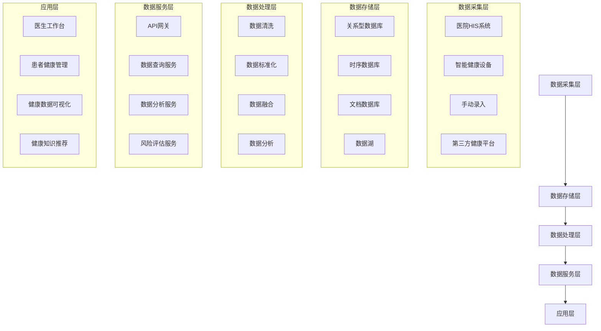

# 多人群健康数据主题库设计方案

## 1. 设计背景与目标

### 1.1 设计背景
随着健康管理理念的深入和医疗信息化的发展，构建面向特定人群的健康数据主题库成为提升健康管理水平的关键。本方案旨在设计一个统一的多人群健康数据主题库，支持孕产妇、幼儿、慢病患者和重点疾病患者等不同人群的健康数据管理和分析。

### 1.2 设计目标
- 构建标准化、规范化的多人群健康数据模型
- 实现多源健康数据的有效整合和管理
- 支持基于数据的健康风险评估和预警
- 提供个性化的健康管理和干预方案
- 为医疗决策和健康政策制定提供数据支持

## 2. 系统架构设计

### 2.1 总体架构
采用分层架构设计，确保系统的可扩展性和可维护性：

### 2.2 技术选型

| 类别 | 技术 | 选型理由 |
|------|------|----------|
| 后端框架 | Spring Boot | 轻量级、高性能、易扩展 |
| 数据库 | PostgreSQL | 强大的关系型数据库，支持JSON类型 |
| 时序数据库 | InfluxDB | 适合存储和分析时间序列数据 |
| 缓存 | Redis | 提高数据访问速度 |
| 消息队列 | Kafka | 支持高并发数据处理 |
| 搜索引擎 | Elasticsearch | 支持全文检索和复杂查询 |
| 前端框架 | Vue.js | 响应式、组件化、易开发 |
| 数据可视化 | ECharts | 丰富的图表类型，支持复杂数据展示 |

## 3. 数据模型设计

### 3.1 基础数据模型

#### 3.1.1 个人基本信息
| 字段名 | 数据类型 | 描述 |
|--------|----------|------|
| person_id | UUID | 个人唯一标识 |
| name | String | 姓名 |
| gender | String | 性别 |
| birthday | Date | 出生日期 |
| id_card | String | 身份证号 |
| contact_info | JSON | 联系方式（电话、邮箱等） |
| address | String | 地址 |
| created_at | Timestamp | 创建时间 |
| updated_at | Timestamp | 更新时间 |

#### 3.1.2 健康档案基础信息
| 字段名 | 数据类型 | 描述 |
|--------|----------|------|
| record_id | UUID | 健康档案ID |
| person_id | UUID | 关联个人ID |
| record_type | String | 档案类型（孕产妇、幼儿、慢病等） |
| start_date | Date | 档案开始日期 |
| end_date | Date | 档案结束日期（如适用） |
| status | String | 档案状态 |
| created_at | Timestamp | 创建时间 |
| updated_at | Timestamp | 更新时间 |

### 3.2 孕产妇群体数据模型

#### 3.2.1 孕产妇基本信息
| 字段名 | 数据类型 | 描述 |
|--------|----------|------|
| maternal_id | UUID | 孕产妇唯一标识 |
| person_id | UUID | 关联个人ID |
| pregnancy_start_date | Date | 妊娠开始日期 |
| expected_delivery_date | Date | 预产期 |
| parity | Integer | 产次 |
| gravidity | Integer | 孕次 |
| medical_history | JSON | 病史信息 |
| family_history | JSON | 家族病史 |
| created_at | Timestamp | 创建时间 |
| updated_at | Timestamp | 更新时间 |

#### 3.2.2 孕期分阶段数据
| 字段名 | 数据类型 | 描述 |
|--------|----------|------|
| stage_id | UUID | 阶段ID |
| maternal_id | UUID | 关联孕产妇ID |
| stage_type | String | 阶段类型（孕早期、孕中期、孕晚期、产褥期） |
| start_date | Date | 阶段开始日期 |
| end_date | Date | 阶段结束日期 |
| health_indicators | JSON | 健康指标 |
| symptoms | JSON | 症状记录 |
| created_at | Timestamp | 创建时间 |
| updated_at | Timestamp | 更新时间 |

#### 3.2.3 胎儿发育数据
| 字段名 | 数据类型 | 描述 |
|--------|----------|------|
| fetus_id | UUID | 胎儿ID |
| maternal_id | UUID | 关联孕产妇ID |
| heart_rate | JSON | 胎心监测数据 |
| ultrasound | JSON | B超检查数据 |
| screening | JSON | 唐筛等筛查结果 |
| growth_indicators | JSON | 生长指标 |
| created_at | Timestamp | 创建时间 |
| updated_at | Timestamp | 更新时间 |

#### 3.2.4 孕产妇风险评估数据
| 字段名 | 数据类型 | 描述 |
|--------|----------|------|
| risk_id | UUID | 风险评估ID |
| maternal_id | UUID | 关联孕产妇ID |
| assessment_date | Date | 评估日期 |
| risk_score | Integer | 风险评分 |
| risk_level | String | 风险等级 |
| risk_factors | JSON | 风险因素 |
| recommendations | JSON | 建议措施 |
| created_at | Timestamp | 创建时间 |
| updated_at | Timestamp | 更新时间 |

### 3.3 幼儿群体数据模型

#### 3.3.1 幼儿基本信息
| 字段名 | 数据类型 | 描述 |
|--------|----------|------|
| child_id | UUID | 幼儿唯一标识 |
| person_id | UUID | 关联个人ID |
| birth_date | Date | 出生日期 |
| birth_weight | Float | 出生体重 |
| birth_height | Float | 出生身高 |
| gestational_age | Integer |  gestational age (weeks) |
| delivery_type | String | 分娩方式 |
| created_at | Timestamp | 创建时间 |
| updated_at | Timestamp | 更新时间 |

#### 3.3.2 生长发育数据
| 字段名 | 数据类型 | 描述 |
|--------|----------|------|
| growth_id | UUID | 生长记录ID |
| child_id | UUID | 关联幼儿ID |
| record_date | Date | 记录日期 |
| age | Integer | 月龄 |
| height | Float | 身高(cm) |
| weight | Float | 体重(kg) |
| head_circumference | Float | 头围(cm) |
| growth_percentile | JSON | 生长百分位 |
| created_at | Timestamp | 创建时间 |
| updated_at | Timestamp | 更新时间 |

#### 3.3.3 疫苗接种数据
| 字段名 | 数据类型 | 描述 |
|--------|----------|------|
| vaccination_id | UUID | 接种记录ID |
| child_id | UUID | 关联幼儿ID |
| vaccine_name | String | 疫苗名称 |
| vaccination_date | Date | 接种日期 |
| dose | Integer | 剂次 |
| manufacturer | String | 生产厂家 |
| batch_number | String | 批次号 |
| side_effects | String | 不良反应 |
| created_at | Timestamp | 创建时间 |
| updated_at | Timestamp | 更新时间 |

#### 3.3.4 发育里程碑数据
| 字段名 | 数据类型 | 描述 |
|--------|----------|------|
| milestone_id | UUID | 里程碑ID |
| child_id | UUID | 关联幼儿ID |
| milestone_type | String | 里程碑类型（大动作、精细动作、语言、认知） |
| milestone_name | String | 里程碑名称 |
| expected_age | Integer | 预期达成月龄 |
| actual_age | Integer | 实际达成月龄 |
| status | String | 达成状态 |
| created_at | Timestamp | 创建时间 |
| updated_at | Timestamp | 更新时间 |

### 3.4 慢病人群数据模型

#### 3.4.1 慢病基本信息
| 字段名 | 数据类型 | 描述 |
|--------|----------|------|
| chronic_id | UUID | 慢病患者唯一标识 |
| person_id | UUID | 关联个人ID |
| disease_type | String | 慢病类型 |
| diagnosis_date | Date | 确诊日期 |
| disease_stage | String | 疾病阶段 |
| severity_level | String | 严重程度 |
| treatment_plan | JSON | 治疗方案 |
| created_at | Timestamp | 创建时间 |
| updated_at | Timestamp | 更新时间 |

#### 3.4.2 慢病监测指标数据
| 字段名 | 数据类型 | 描述 |
|--------|----------|------|
| monitoring_id | UUID | 监测记录ID |
| chronic_id | UUID | 关联慢病患者ID |
| record_date | Timestamp | 记录时间 |
| indicator_type | String | 指标类型（血压、血糖、血脂等） |
| value | Float | 指标值 |
| unit | String | 单位 |
| measurement_method | String | 测量方法 |
| created_at | Timestamp | 创建时间 |

#### 3.4.3 干预行为数据
| 字段名 | 数据类型 | 描述 |
|--------|----------|------|
| intervention_id | UUID | 干预记录ID |
| chronic_id | UUID | 关联慢病患者ID |
| intervention_type | String | 干预类型（用药、饮食、运动等） |
| intervention_date | Date | 干预日期 |
| compliance | Integer | 依从度（0-100） |
| notes | String | 备注 |
| created_at | Timestamp | 创建时间 |
| updated_at | Timestamp | 更新时间 |

#### 3.4.4 并发症风险数据
| 字段名 | 数据类型 | 描述 |
|--------|----------|------|
| complication_id | UUID | 并发症风险ID |
| chronic_id | UUID | 关联慢病患者ID |
| assessment_date | Date | 评估日期 |
| complication_type | String | 并发症类型 |
| risk_score | Integer | 风险评分 |
| risk_level | String | 风险等级 |
| preventive_measures | JSON | 预防措施 |
| created_at | Timestamp | 创建时间 |
| updated_at | Timestamp | 更新时间 |

### 3.5 重点疾病数据模型

#### 3.5.1 重点疾病基本信息
| 字段名 | 数据类型 | 描述 |
|--------|----------|------|
| disease_id | UUID | 疾病记录ID |
| person_id | UUID | 关联个人ID |
| disease_name | String | 疾病名称 |
| diagnosis_date | Date | 确诊日期 |
| clinical_data | JSON | 临床数据 |
| lab_indicators | JSON | 实验室指标 |
| treatment_path | JSON | 治疗路径 |
| created_at | Timestamp | 创建时间 |
| updated_at | Timestamp | 更新时间 |

#### 3.5.2 疾病队列数据
| 字段名 | 数据类型 | 描述 |
|--------|----------|------|
| cohort_id | UUID | 队列ID |
| disease_name | String | 疾病名称 |
| inclusion_criteria | JSON | 入组标准 |
| exclusion_criteria | JSON | 排除标准 |
| cohort_size | Integer | 队列规模 |
| cohort_characteristics | JSON | 队列特征 |
| start_date | Date | 队列开始日期 |
| end_date | Date | 队列结束日期 |
| created_at | Timestamp | 创建时间 |
| updated_at | Timestamp | 更新时间 |

#### 3.5.3 个体-群体对照数据
| 字段名 | 数据类型 | 描述 |
|--------|----------|------|
| comparison_id | UUID | 对照ID |
| person_id | UUID | 关联个人ID |
| disease_id | UUID | 关联疾病ID |
| cohort_id | UUID | 关联队列ID |
| comparison_date | Date | 对照日期 |
| individual_features | JSON | 个体特征 |
| population_features | JSON | 人群特征 |
| deviation | JSON | 偏离程度 |
| created_at | Timestamp | 创建时间 |
| updated_at | Timestamp | 更新时间 |

#### 3.5.4 疾病预后评估数据
| 字段名 | 数据类型 | 描述 |
|--------|----------|------|
| prognosis_id | UUID | 预后评估ID |
| person_id | UUID | 关联个人ID |
| disease_id | UUID | 关联疾病ID |
| assessment_date | Date | 评估日期 |
| treatment_effect | String | 治疗效果 |
| prognosis_score | Integer | 预后评分 |
| recurrence_risk | String | 复发风险 |
| follow_up_plan | JSON | 随访计划 |
| created_at | Timestamp | 创建时间 |
| updated_at | Timestamp | 更新时间 |

## 4. 功能模块设计

### 4.1 数据采集模块
- **医院数据集成**：通过HL7、FHIR等标准接口与医院HIS系统集成
- **智能设备数据接入**：支持蓝牙、WiFi等方式接入智能健康设备数据
- **手动录入**：提供Web和移动端录入界面
- **第三方平台数据同步**：支持从健康管理平台、保险公司等同步数据

### 4.2 数据管理模块
- **数据清洗**：自动识别和修正数据异常
- **数据标准化**：将不同来源的数据转换为标准格式
- **数据融合**：整合多源数据，构建完整的健康档案
- **数据质量监控**：定期检查数据质量，生成质量报告

### 4.3 数据分析模块
- **趋势分析**：分析健康指标的变化趋势
- **风险评估**：基于数据模型评估健康风险
- **预测模型**：预测疾病发展和健康趋势
- **队列分析**：分析特定人群的健康特征

### 4.4 智能应用模块
- **健康预警**：基于风险评估结果发送预警信息
- **个性化建议**：根据健康数据提供个性化健康建议
- **知识推荐**：关联相关健康知识，提供教育内容
- **决策支持**：为医疗决策提供数据支持

### 4.5 安全与隐私模块
- **数据加密**：对敏感数据进行加密存储和传输
- **访问控制**：基于角色的访问权限管理
- **审计日志**：记录所有数据访问和操作
- **隐私保护**：符合GDPR、HIPAA等隐私法规要求

## 5. 实施路径

### 5.1 阶段一：基础建设（1-3个月）
- 搭建基础技术架构
- 实现核心数据模型
- 开发数据采集接口
- 建立安全防护体系

### 5.2 阶段二：功能开发（3-6个月）
- 开发各人群数据模型的具体功能
- 实现数据集成和管理功能
- 开发数据分析和智能应用模块
- 进行系统测试和优化

### 5.3 阶段三：试点运行（2-3个月）
- 选择1-2个医疗机构进行试点
- 收集用户反馈，优化系统功能
- 完善数据模型和业务流程

### 5.4 阶段四：全面推广（3-6个月）
- 扩展系统部署范围
- 与更多医疗机构和健康管理机构合作
- 持续优化系统性能和功能

## 6. 预期效果

### 6.1 对医疗机构
- 提高健康数据管理效率
- 支持精准医疗决策
- 优化医疗资源配置
- 提升医疗服务质量

### 6.2 对患者
- 获得个性化的健康管理方案
- 及时了解健康风险
- 便捷获取健康知识
- 提高健康自我管理能力

### 6.3 对健康管理
- 实现人群健康状况的实时监控
- 支持健康政策的制定和评估
- 促进健康管理模式的创新
- 提升整体健康管理水平

## 7. 风险与应对措施

| 风险 | 应对措施 |
|------|----------|
| 数据质量问题 | 建立数据质量控制体系，定期进行数据清洗和验证 |
| 数据安全风险 | 实施多层次安全防护措施，包括加密、访问控制和审计 |
| 系统集成难度 | 采用标准化接口，与各系统厂商密切合作 |
| 用户接受度低 | 提供直观易用的界面，加强用户培训和教育 |
| 法规合规风险 | 密切关注相关法规变化，确保系统符合法规要求 |

## 8. 结论

本设计方案通过构建标准化、规范化的多人群健康数据主题库，实现了健康数据的有效整合和管理，为精准健康管理和医疗决策提供了有力支持。系统采用先进的技术架构和数据模型，具有良好的可扩展性和可维护性，能够适应未来健康管理的发展需求。通过分阶段实施，逐步完善系统功能，最终实现提升整体健康管理水平的目标。